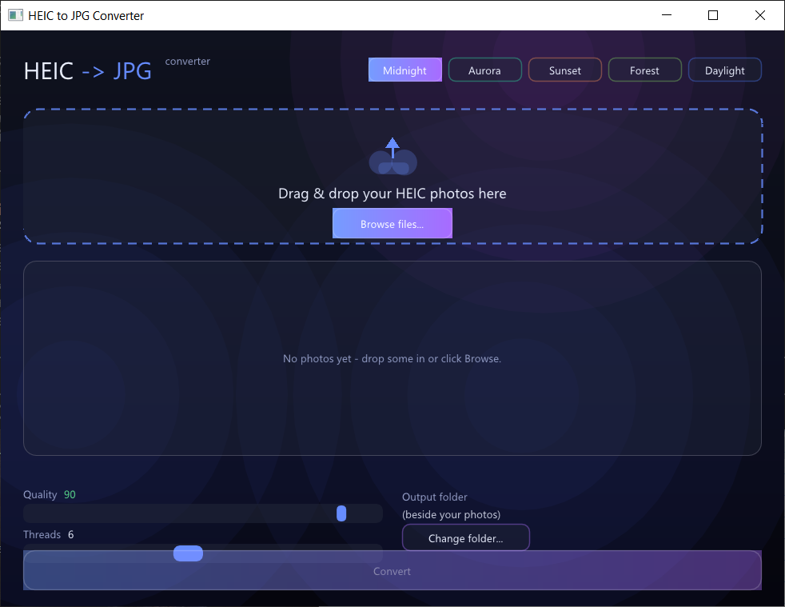
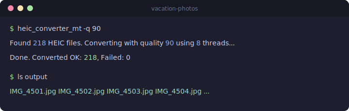

# HEIC to JPG Converter

Batch-convert iPhone `.heic` photos to `.jpg` — as a polished drag-and-drop **desktop app** or a fast **command-line tool**. Multithreaded, works on Windows and macOS, and every download is a single self-contained binary — no libraries or runtimes to install.

## Desktop app

Drag your photos in (or browse), pick the quality and thread count, click **Convert**, and watch an animated progress view. Five switchable themes with smooth transitions, a live drop zone, per-file status, and a confetti finish.



Download from the [**Releases page**](https://github.com/assekho2/Heic_to_Jpg_Converter/releases):

| Platform | File |
|---|---|
| Windows 10/11 (x64) | `heic_converter_gui-windows-x64.zip` |
| macOS (Apple Silicon) | `heic_converter_gui-macos-arm64.tar.gz` |

Unzip and run **`heic_converter_gui`**. On Windows, SmartScreen may warn about the unsigned download — click **More info → Run anyway**. On macOS, the first launch is blocked — right-click the app, choose **Open**, then **Open** again (or run `xattr -d com.apple.quarantine ./heic_converter_gui`).

## Command-line tool

A scriptable, no-frills batch converter for folders of photos.



### Download

Grab the latest release from the [**Releases page**](https://github.com/assekho2/Heic_to_Jpg_Converter/releases):

| Platform | File |
|---|---|
| Windows 10/11 (x64) | `heic_converter_mt-windows-x64.zip` |
| macOS (Apple Silicon) | `heic_converter_mt-macos-arm64.tar.gz` |

### Quick start

Each download unzips to a `HEIC-to-JPG-Converter` folder containing the program, a `photos to convert` folder, a double-click launcher, and a `readme.txt`.

#### Windows

1. Unzip the download. Open the `HEIC-to-JPG-Converter` folder.
2. Drop your `.heic` photos into the `photos to convert` folder.
3. Double-click **`Convert.bat`**. JPEGs appear in a new `output` subfolder.

> **"Windows protected your PC"?** SmartScreen warns about unsigned downloads. Click **More info → Run anyway**.

Prefer a terminal? Type `cmd` in the Explorer address bar and run `heic_converter_mt.exe "photos to convert"`.

#### macOS

1. Unzip the download (double-click the `.tar.gz`). Open the `HEIC-to-JPG-Converter` folder.
2. Drop your `.heic` photos into the `photos to convert` folder.
3. Double-click **`Convert.command`**. JPEGs appear in a new `output` subfolder.

   First run only: macOS may block the unsigned launcher — right-click `Convert.command`, choose **Open**, then **Open** again.

Prefer a terminal? Run `xattr -d com.apple.quarantine ./heic_converter_mt` once, then `./heic_converter_mt "photos to convert"`.

Full instructions are also in the `readme.txt` inside each download.

## Usage

```
heic_converter_mt [options] [input_dir]

Converts every .heic file in input_dir (default: current directory)
to a .jpg in the output directory, using multiple threads.

Options:
  -o, --output <dir>   output directory (default: output)
  -q, --quality <n>    JPEG quality 1-100 (default: 90)
  -t, --threads <n>    worker threads (default: CPU cores)
  -h, --help           show this help and exit
  -V, --version        show version and exit
```

Examples:

```bash
heic_converter_mt ~/Pictures/vacation            # convert a specific folder
heic_converter_mt -q 85 -o converted             # quality 85, custom output folder
heic_converter_mt -t 4                           # limit to 4 threads
```

## Building from source

The repo contains a shared conversion engine plus three front-ends:

- `converter_core.{h,cpp}` — the decode/encode/threading engine, shared by everything below
- `heic_converter_mt.cpp` — the multithreaded CLI (this is what CLI releases ship)
- `heic_converter.c` — a simpler single-threaded CLI
- `gui/main.cpp` — the Dear ImGui desktop app

The CLIs build on Windows, macOS, and Linux via the Makefile; the GUI builds via CMake.

### Dependencies

- **macOS:** `brew install libheif jpeg`
- **Windows:** install [MSYS2](https://www.msys2.org), then in a UCRT64 shell:
  `pacman -S mingw-w64-ucrt-x86_64-gcc mingw-w64-ucrt-x86_64-libheif mingw-w64-ucrt-x86_64-libjpeg-turbo make`
- **Linux:** `sudo apt install build-essential libheif-dev libjpeg-dev`

### Build

```bash
make                  # both converters, linked against system libraries
make static           # portable heic_converter_mt with libheif/libde265/libjpeg
                      # statically linked (what CI builds for releases)
```

`make static` runs `scripts/build_static.sh`, which downloads and builds libheif (HEIC decode only) from source. It needs cmake/ninja/pkgconf on Windows (`pacman -S mingw-w64-ucrt-x86_64-cmake mingw-w64-ucrt-x86_64-ninja mingw-w64-ucrt-x86_64-pkgconf`) or `brew install cmake ninja jpeg-turbo` on macOS.

### Desktop app (GUI)

The GUI links the same engine and pulls GLFW, [Dear ImGui](https://github.com/ocornut/imgui), and a [native file dialog](https://github.com/btzy/nativefiledialog-extended) via CMake `FetchContent`, so the only system dependency beyond a C++17 toolchain is OpenGL. Run `make static` once first (so libheif is built into `build/deps/prefix`), then:

```bash
cmake -S . -B build/gui -G Ninja -DCMAKE_BUILD_TYPE=Release
cmake --build build/gui          # -> build/gui/heic_converter_gui[.exe]
```

The result is a single self-contained binary (~9 MB on Windows). Note: the UI currently renders at a fixed scale, so it looks slightly soft on high-DPI displays — proper per-monitor DPI scaling is a planned follow-up.

## Releases / CI

GitHub Actions builds the Windows and macOS CLI **and** GUI binaries on every push. Pushing a tag like `v1.2.0` builds, packages, and attaches them all to a GitHub Release automatically.

## License

[MIT](LICENSE). HEIC decoding uses [libheif](https://github.com/strukturag/libheif) and [libde265](https://github.com/strukturag/libde265); JPEG encoding uses [libjpeg-turbo](https://github.com/libjpeg-turbo/libjpeg-turbo).
